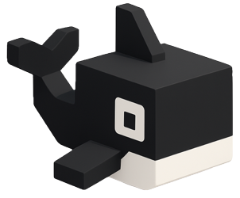

[](https://pypi.python.org/pypi/blackfish-ai)
[](https://github.com/princeton-ddss/blackfish)

# Blackfish



Blackfish is an open source "ML-as-a-Service" (MLaaS) platform that helps researchers use state-of-the-art, open source artificial intelligence and machine learning models. With Blackfish, researchers can spin up their own version of popular public cloud services (e.g., ChatGPT, Amazon Transcribe, etc.) using high-performance computing (HPC) resources already available on campus.

The primary goal of Blackfish is to facilitate **transparent** and **reproducible** research based on **open source** machine learning and artificial intelligence. We do this by providing mechanisms to run user-specified models with user-defined configurations. For academic research, open source models present several advantages over closed source models. First, whereas large-scale projects using public cloud services might cost $10K to $100K for [similar quality results](https://www.frontiersin.org/journals/big-data/articles/10.3389/fdata.2023.1210559/full), open source models running on HPC resources are free to researchers. Second, with open source models you know *exactly* what model you are using and you can easily provide a copy of that model to other researchers. Closed source models can and do change without notice. Third, using open-source models allows complete transparency into how *your* data is being used.

## Why should you use Blackfish?

### 1. It's easy! 😎

Researchers should focus on research, not tooling. We try to meet researchers where they're at by providing multiple ways to work with Blackfish, including a Python API, a command-line tool (CLI), and a browser-based user interface (UI).

Don't want to install a Python package? Ask your HPC admins to install [Blackfish OnDemand](https://github.com/princeton-ddss/blackfish-ondemand)!

### 2. It's transparent 🔍

You decide what model to run (down to the Git commit) and how you want it configured. There are no unexpected (or undetected) changes in performance because the model is always the same. All services are *private*, so you know exactly how your data is being handled.

### 3. It's free! 💸

You have an HPC cluster. We have software to run on it.

> [!NOTE]
> This README explains how to install and use Blackfish via the CLI. The easiest way to get started using Blackfish is via Open OnDemand, which allows users to access the user interface via a web browser with zero setup. If your HPC admins have enabled Blackfish on your cluster's OnDemand portal, feel free to skip these instructions and start there.

## Installation

Blackfish is a `pip`-installable Python package. We recommend installing Blackfish to its own virtual environment, for example:

```shell
python -m venv .venv
source .venv/bin/activate
pip install blackfish-ai
```

Or, using `uv`:

```shell
uv venv
uv pip install blackfish-ai
```

The following command should return the version of Blackfish if installation was successful:

```shell
blackfish version
```

## Quickstart

This guide walks through using Blackfish on an HPC cluster via the Slurm job scheduler. Start by logging into your cluster, then follow the steps below. For other configurations, see [Profiles](#profiles).

### Setup

Before you begin using Blackfish, you'll need to initialize the application. To do so, type

```shell
blackfish init
```

at the command line. This command will prompt you to provide details for a Blackfish *profile*. Let's create a default profile that will allow us to run services on compute nodes via the Slurm job scheduler:

```
name=default
type=slurm
host=localhost
user=shamu
home=/home/shamu/.blackfish
cache=/scratch/gpfs/shared/.blackfish
```

`cache` is a shared directory set up by your HPC admin for storing shared model and image files. This quickstart assumes you have access to a cache directory with all required container images downloaded. If your HPC does not have a cache set up, you can assign the same directory used for `home` and [add the images yourself](https://princeton-ddss.github.io/blackfish/latest/setup/management/#images).

Once Blackfish is properly initialized, you can run the `blackfish start` command to launch the application:

```shell
blackfish start
```

If everything is working, you should see output like the following:

```shell
INFO:     Added class SpeechRecognition to service class dictionary. [2025-02-24 11:55:06.639]
INFO:     Added class TextGeneration to service class dictionary. [2025-02-24 11:55:06.639]
WARNING:  Blackfish is running in debug mode. API endpoints are unprotected. In a production
          environment, set BLACKFISH_DEBUG=0 to require user authentication. [2025-02-24 11:55:06.639]
INFO:     Upgrading database... [2025-02-24 11:55:06.915]
WARNING:  Current configuration will not reload as not all conditions are met, please refer to documentation.
INFO:     Started server process [58591]
INFO:     Waiting for application startup.
INFO:     Application startup complete.
INFO:     Uvicorn running on http://localhost:8000 (Press CTRL+C to quit)
```

Congratulations—Blackfish is now up and running! The application serves the user interface as well as endpoints to manage services and Blackfish itself. The rest of this guide will walk through how to use the CLI to interact with these endpoints.

### Running Services

Let's start by exploring what services are available. In a new terminal (with your virtual environment activated), type

```shell
blackfish run --help
```

The output displays a list of available commands. One of these commands is `text-generation`, which launches a service to generate text given an input prompt or message history (for models supporting chat). There are *many* [models](https://huggingface.co/models?pipeline_tag=text-generation&sort=trending) to choose from to perform this task, but Blackfish only allows you to run models you have already downloaded. To view a list of available models, run

```shell
blackfish model ls --image=text-generation --refresh
```

This command shows all models that we can pass to the `blackfish run text-generation` command. Because we haven't downloaded any models yet (unless your profile connected to a shared model repo), our list is empty! Let's add a "tiny" model:

```shell
blackfish model add TinyLlama/TinyLlama-1.1B-Chat-v1.0  # This will take a minute...
```

Once the model is done downloading, you can check that it is available by re-running the `blackfish model ls --image=text-generation --refresh` command. We're now ready to spin up a `text-generation` service:

```shell
blackfish run --gres 1 --time 00:30:00 text-generation TinyLlama/TinyLlama-1.1B-Chat-v1.0 --api-key sealsaretasty
```

This command should produce output similar to:

```
✔ Found 49 models.
✔ Found 1 snapshots.
⚠ No revision provided. Using latest available commit: fe8a4ea1ffedaf415f4da2f062534de366a451e6.
✔ Found model TinyLlama/TinyLlama-1.1B-Chat-v1.0!
✔ Started service: 55862e3b-c2c2-428d-ac2d-89bdfa911fa4
```

Take note of the service ID returned. We can use this ID to view more information about the service by running:

```shell
blackfish ls
```

That command should return a table like the following:

```
SERVICE ID      IMAGE             MODEL                                CREATED     UPDATED     STATUS    PORT   NAME              PROFILE
55862e3b-c2c2   text_generation   TinyLlama/TinyLlama-1.1B-Chat-v1.0   3 sec ago   3 sec ago   PENDING   None   blackfish-77771   default
```

As you can see, the service is still waiting in the job queue (`PENDING`). It might take a few minutes for a Slurm job to start, and it will require additional time for the service to load after it starts. Until then, our service's status will be either `PENDING` or `STARTING`. Now would be a good time to make some tea 🫖

> [!TIP]
> While you're doing that, note that you can obtain additional information about an individual service with the `blackfish details <service_id>` command. Now back to that tea...

Now that we're refreshed, let's see how our service is getting along. Re-run the command above:

```shell
blackfish ls
```

If things went well, the service's status should now be `HEALTHY`. At this point, we can start using the service. Let's ask an important question:

```shell
curl http://localhost:8080/v1/chat/completions \
  -H "Content-Type: application/json" \
  -H "Authorization: Bearer sealsaretasty" \
  -d '{
        "messages": [
            {"role": "system", "content": "You are an expert marine biologist."},
            {"role": "user", "content": "Why are orcas so awesome?"}
        ],
        "max_completion_tokens": 100,
        "temperature": 0.1,
        "stream": false
    }' | jq
```

This request should generate a response like the following:

```shell
  % Total    % Received % Xferd  Average Speed   Time    Time     Time  Current
                                 Dload  Upload   Total   Spent    Left  Speed
100  1191  100   910  100   281   1332    411 --:--:-- --:--:-- --:--:--  1743
{
  "id": "chatcmpl-93f94b03258044cba7ad8ada48b01e5b",
  "object": "chat.completion",
  "created": 1748628455,
  "model": "/data/snapshots/fe8a4ea1ffedaf415f4da2f062534de366a451e6",
  "choices": [
    {
      "index": 0,
      "message": {
        "role": "assistant",
        "reasoning_content": null,
        "content": "Orcas, also known as killer whales, are incredibly intelligent and social animals that are known for their incredible abilities. Here are some reasons why orcas are so awesome:\n\n1. Intelligence: Orcas are highly intelligent and have been observed using tools, communication, and social behavior to achieve their goals. They are also highly adaptable and can live in a variety of environments, including marine and freshwater habitats.\n\n2. Strength:",
        "tool_calls": []
      },
      "logprobs": null,
      "finish_reason": "length",
      "stop_reason": null
    }
  ],
  "usage": {
    "prompt_tokens": 40,
    "total_tokens": 140,
    "completion_tokens": 100,
    "prompt_tokens_details": null
  },
  "prompt_logprobs": null
}
```

Success! Our service is responding as expected. Feel free to play around with this model to your heart's delight. It should remain available for approximately thirty minutes (`--time 00:30:00`).

> [!TIP]
> The text generation service runs an OpenAI-compatible `vllm` server. You can interact with text generation services using OpenAI's official Python library, `openai`. If you're already using `openai` to work with proprietary models like ChatGPT, your existing scripts should work with minimal modification!

When you're done with the service, shut it down to return its resources to the cluster:

```shell
blackfish stop 55862e3b-c2c2-428d-ac2d-89bdfa911fa4
```

If you run `blackfish ls` once more, you should see that the service is no longer listed: `ls` only displays *active* services by default. You can view *all* services by including the `--all` flag. Services remain in your services database until you explicitly remove them, like so:

```shell
blackfish rm --filters id=55862e3b-c2c2-428d-ac2d-89bdfa911fa4
```

## Profiles

Profiles tell Blackfish where and how to run services. You can create profiles for local execution or remote execution on a Slurm cluster. The `blackfish init` command walks you through creating a default profile, and you can add more at any time. For details, refer to our [documentation](https://princeton-ddss.github.io/blackfish/latest/usage/cli/#profiles).

### Remote Access via SSH

Remote profiles require password-less SSH access to your cluster. On many systems, this is simple to set up with the `ssh-keygen` and `ssh-copy-id` utilities. First, make sure that you are connected to your institution's network or VPN (if required), then type the following at the command-line:

```shell
ssh-keygen -t rsa # generates ~/.ssh/id_rsa.pub and ~/.ssh/id_rsa
ssh-copy-id <user>@<host> # answer yes to transfer the public key
```

These commands create a secure public-private key pair and send the public key to the HPC server you need access to. You now have password-less access to your HPC server!

## Images

Blackfish does not ship Docker images required to run services. When running jobs locally, Docker will attempt to download the required image before starting the service, resulting in delays during the launching step. Instead, it's recommended that users pre-download the required images listed below.

> [!NOTE]
> When running services on Slurm clusters, Blackfish looks for the required SIF file in `$PROFILE_CACHE_DIR/images`.

Run `blackfish images` to see the pinned image references and SIF filenames for your installed version.

You can pin a different image at deploy time with the per-service env vars `BLACKFISH_TEXT_GENERATION_IMAGE` and `BLACKFISH_SPEECH_RECOGNITION_IMAGE` (format: `repo:tag`). These are surfaced through `blackfish images` and `/api/info`, so the rest of the system stays in sync with your override.

## Models

Blackfish (or rather, the services Blackfish runs) does not guarantee support for every model available from the [Hugging Face Model Hub](https://huggingface.co/models). As a practical matter, however, services support nearly all "popular" models listed under their corresponding pipeline, including many "quantized" models (in the case of LLMs). Below is an evolving list of models that we have tested on HPC, including the resources requested and utilized by the service.

The main requirement to run online inference is sufficient GPU memory. As a rule-of-thumb, the *minimum* memory required for a model is obtained by multiplying the number of parameters (in billions) times the number of bytes per parameter (`dtype / 8`). In practice, you need to budget an additional 5-10 GB for KV caching and keep in mind that default GPU utilization is typically set to around 90-95% by service images.

> [!NOTE]
> The table below is a best-effort snapshot of what we've actively tested on
> Princeton's HPC. Models and their resource needs change quickly, so treat
> this as a starting point rather than a guarantee. Unlisted models from the
> same pipeline will generally work as long as they fit within your requested
> resources.

| Model                                        | Pipeline                     | Supported | Chat     | Gated | Reasoning | Embedding [^1] | Memory | GPUs       | Cores | Size  | Dtype | Notes                                                                                                                  |
|----------------------------------------------|------------------------------|-----------|----------|-------|-----------|----------------|--------|------------|-------|-------|-------|------------------------------------------------------------------------------------------------------------------------|
| Qwen/QwQ-32B                                 | Text-generation              | ✅        | ✅       |       | ✅        |  ✅            | 16G    |  61.0/160G | 4     | 32.8B | bf16  | Supports reasoning. See [docs](https://docs.vllm.ai/en/stable/features/reasoning_outputs.html).                       |
| Qwen/Qwen3-32B                               | Text-generation              | ✅        | ✅       |       | ✅        | ✅             | 16G    |  64.4/160G | 4     | 32.8B | bf16  | Supports reasoning. See [docs](https://docs.vllm.ai/en/stable/features/reasoning_outputs.html).                       |
| Qwen/Qwen2.5-72B                             | Text-generation              | ✅        |          |       |           | ✅             | 16G    | 144.8/320G | 4     | 72.7B | bf16  | Possible to fit on 2x80B by decreasing `max_model_len` or increasing `gpu_memory_utilization`.                         |
| Qwen/Qwen2.5-72B-Instruct                    | Text-generation              | ✅        | ✅       |       |           | ✅             | 16G    | 144.8/320G | 4     | 72.7B | bf16  | Possible to fit on 2x80B by decreasing `max_model_len` or increasing `gpu_memory_utilization`.                         |
| Qwen/Qwen2.5-32B                             | Text-generation              | ✅        |          |       |           | ✅             | 16G    |   63.1/80G | 4     | 32.8B | bf16  |                                                                                                                        |
| Qwen/Qwen2.5-32B-Instruct                    | Text-generation              | ✅        | ✅       |       |           | ✅             | 16G    |   63.1/80G | 4     | 32.8B | bf16  |                                                                                                                        |
| google/gemma-3-27b-it                        | Text-generation              | ✅        | ✅       | ✅    |           | ❌             | 16G    |   54.1/80G | 4     | 27.4B | bf16  |                                                                                                                        |
| google/gemma-3-1b-it                         | Text-generation              | ✅        | ✅       | ✅    |           |  ✅            | 8G     |       /10G | 4     | 1.0B | bf16  |                                                                                                                        |
| meta-llama/Llama-4-Scout-17B-16E-Instruct    | Text-generation              | ✅        | ✅       | ✅    |           |                | 32G    |      /320G | 4     |  109B | bf16  | Supports multimodal inputs. See [docs](https://docs.vllm.ai/en/latest/features/multimodal_inputs.html#online-serving). |
| meta-llama/Llama-4-Scout-17B-16E             | Text-generation              | ✅        |          | ✅    |           |                | 32G    |      /320G | 4     |  109B | bf16  | Supports multimodal inputs. See [docs](https://docs.vllm.ai/en/latest/features/multimodal_inputs.html#online-serving). |
| meta-llama/Llama-3.3-70B-Instruct            | Text-generation              | ✅        | ✅       | ✅    |           |  ✅            | 16G    | 140.4/320G | 4     | 70.6B | bf16  |                                                                                                                        |
| deepseek-ai/DeepSeek-R1-Distill-Llama-70B    | Text-generation              | ✅        | ✅       |       | ✅        |  ✅            | 16G    | 141.2/320G | 4     | 70.6B | bf16  | Supports reasoning. See [docs](https://docs.vllm.ai/en/stable/features/reasoning_outputs.html).                       |
| deepseek-ai/DeepSeek-R1-Distill-Qwen-32B     | Text-generation              | ✅        | ✅       |       | ✅        |  ✅            | 16G    |   64.6/80G | 4     | 32.8B | bf16  | Supports reasoning. See [docs](https://docs.vllm.ai/en/stable/features/reasoning_outputs.html).                       |
| deepseek-ai/DeepSeek-V2-Lite                 | Text-generation              | ✅        |          |       |           |  ✅            | 16G    |   30.5/40G | 4     | 15.7B | bf16  |                                                                                                                        |
| deepseek-ai/DeepSeek-V2-Lite-Chat            | Text-generation              | ✅        | ✅       |       |           | ✅             | 16G    |   30.5/40G | 4     | 15.7B | bf16  |                                                                                                                        |
| openai/whisper-large-v3                      | Automatic-speech-recognition | ✅        |          |       |           |                | -      |    3.6/10G | 1     | 1.54B | f16   |                                                                                                                        |

## Development

This is a monorepo containing:

| Package | Description |
|---------|-------------|
| [lib/](lib/) | Python backend (`blackfish-ai`) - CLI, server, services |
| [web/](web/) | Vite + React frontend (`blackfish-ui`) - browser interface |

See the package READMEs for development setup instructions.

## Want to learn more?

You can find additional details and examples on our official [documentation page](https://princeton-ddss.github.io/blackfish/).

[^1]: Models that can be used to retrieve embeddings with --task embed
