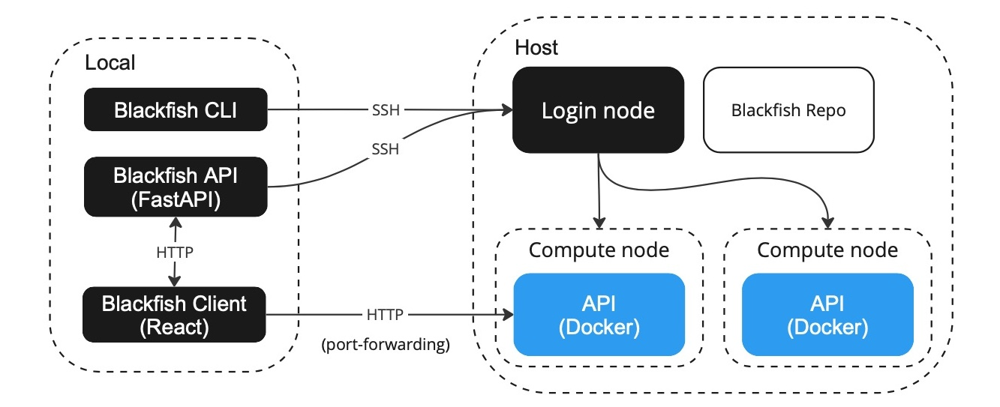

# Welcome to Blackfish!
Blackfish is an open source "ML-as-a-Service" (MLaaS) platform that helps researchers
use state-of-the-art, open source artificial intelligence and machine learning models.
With Blackfish, researchers can spin up their own version of popular public cloud services (e.g., ChatGPT, Amazon Transcribe, etc.) using high-performance computing (HPC) resources already available on their campus.[^1]

The primary goal of Blackfish is to facilitate transparent and reproducible[^2] research based on open source machine learning and artificial intelligence. We do this by providing mechanisms to run *specific* models with user-defined configurations. For academic research, open source models have several advantages over closed source models. First, they are free, whereas large-scale projects using public cloud options might cost $10K to $100K for [similar quality results](). Second, with open source models you know *exactly* what model you are using and you can easily provide a copy of that model to other researchers. Closed source models can and *do* change without notice. Third, using open-source models allows complete transparency into how *your* data is being used. Q.E.D.

## Why Blackfish?

### 1. It's easy! 🌈
Researchers should focus on research, not tooling. We try to meet researchers where they're at by providing multiple ways to work with Blackfish, including a CLI and browser-based UI.

Don't want to install Python packages? [Ask your HPC admins to add Blackfish to your Open OnDemand portal](https://github.com/princeton-ddss/blackfish-ondemand)!

### 2. It's transparent 🧐
You decide what model to run (down to the Git commit) and how you want it configured. There are no unexpected (or undetected) changes in performance because the model is always the same. All services are private—always—so you know *exactly* how your data is being handled.

### 3. It's free! 💸
You have an HPC cluster. We have software to run on it.

## Quickstart

### Step 1 - Install blackfish
```shell
pip install blackfish-ml
```

### Step 2 - Create a profile
```shell
blackfish init

# Example responses
# > name: default
# > type: slurm
# > host: della.princeton.edu
# > user: timmy
# > home: /home/timmy123/.blackfish
# > cache: /scratch/gpfs/shared/.blackfish
```

### Step 3 - Start the API
```shell
blackfish start
```

### Step 4 - Obtain a model
```shell
# This will take awhile...
blackfish model add --profile default deepseek-ai-deepseek-llm-67b-chat
```

### Step 5 - Run a service
```shell
blackfish run --profile default --gres 2 --mem 32 --time 00:05:00 text-generation deepseek-ai/deepseek-llm-67b-chat
```

### Step 6 - Submit a request
```shell
# First, check the service status...
blackfish ls

# Once the service is healthy...
curl -X 'POST'  'http://0.0.0.0:8080/generate_stream'  -H 'accept: application/json'  -H 'Content-Type: application/json'  -d '{"inputs": "Who founded Princeton University?", "max_new_tokens": 200}'
```

## How does Blackfish work?
Blackfish consists of three primary components: the core API ("Blackfish API"), a command-line
interface ("Blackfish CLI") and a (graphical) user interface ("Blackfish UI"). The Blackfish
API performs all essential operations while the Blackfish CLI and UI provide convenient methods
for interacting with the Blackfish API. Essentially, the Blackfish API automates the process of
hosting AI models as APIs. That is, a user tells the Blackfish API—directly or via an interface—the
model she wants to use and the Blackfish API creates a "service API" running that model. The researcher
that starts the service owns the API: they have exclusive access to its use and "own" the resources
(e.g., CPU and GPU memory) required to deploy it.

In addition to starting the service, Blackfish keeps track of the service's status and allows the
researcher to stop the service when she is done using it.

In general, the service API will not be running on the same machine as the Blackfish application.
Instead, when the user requests a model, she will also specify a host for that model. The service API
runs on the specifieid host and Blackfish takes care of ensuring that the interface is able to communicate
with the remote service API.



**Figure** The Blackfish architecture for running remote service APIs on a Slurm cluster.

## Requirements
Blackfish requires Python to run locally. Alternatively, Blackfish can be added to your university's [Open OnDemand](https://openondemand.org/) portal, which allows users to run applications on HPC resources through a web browser. For more information, see our companion repo [blackfish-ondemand](https://github.com/princeton-ddss/blackfish-ondemand).

## Acknowledgements
Blackfish is developed by research software engineers at Princeton University's
Data Driven Social Science Initiative.

[^1]: Support is currently limited to clusters running the Slurm job manager.
[^2]: Inference results may not be "exactly reproducible"—i.e., generating same outputs from same inputs—depending on the details of the model and inference settings. Blackfish allows researchers to "reproduce" findings in the sense of running the exact same model with the exact same settings.
