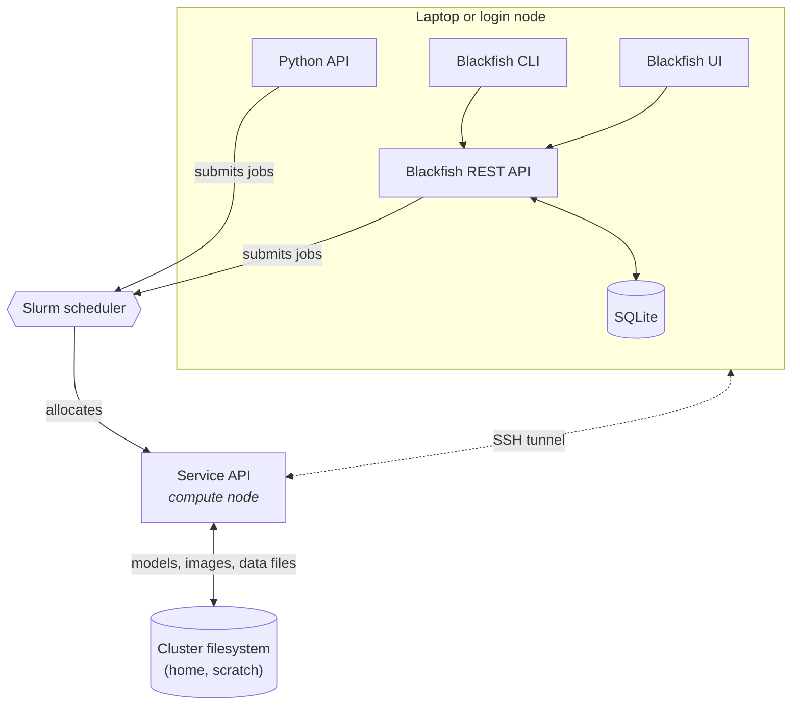

# Architecture Overview

Blackfish consists of four components: a core REST API, a command-line interface (CLI), a browser-based user interface (UI), and a Python API. The core REST API performs all key service management operations while the Blackfish CLI and UI provide convenient methods for interacting with the Blackfish API. The Python API allows researchers to use Blackfish within Python scripts and pipelines.

**Figure 1** The Blackfish architecture for running services on a Slurm cluster.

The Blackfish REST API automates the process of hosting AI models as APIs. Users instruct the Blackfish API via the CLI or UI to deploy a model and the REST API creates a "service API" running that model. The researcher that starts a service "owns" that service and can secure it with an API key. Blackfish tracks service status and provides methods to stop and delete services when they are no longer needed.

In general, service APIs do not run on the same machine as the Blackfish application. Researchers can run the Blackfish API on their local laptop or on an HPC login node. When a researcher requests a model, they must specify a host for the service. The service API runs on the specified host and Blackfish ensures that it is able to communicate with the possibly remote service API. Typically, users will run services on high-performance GPUs available on an HPC cluster with a Slurm job scheduler.

!!! note

    Blackfish doesn't synchronize application data across machines. Services started from your laptop will not appear when running `blackfish ls` on the cluster, and vice versa.

## Application Data

Blackfish stores data in several different locations:

- Core application data is stored in `BLACKFISH_HOME_DIR` on the system where Blackfish is running (`~/.blackfish` by default). Core application data includes profile configuration, application logs, and database storage.
- Models and images are stored in the user-defined locations `home_dir` and `cache_dir`. These are profile-specific locations that need not reside on the machine where Blackfish is running. `home_dir` also stores job files created each time a service launches.

Let's consider what happens when a user launches a service from their laptop targeting a remote HPC cluster (Figure 1). The user will specify a profile that tells Blackfish the `host` and `user` of the targeted cluster. Blackfish uses this information to look for the required model and image files in both `home_dir` and `cache_dir`—also specified by the profile—on the cluster. If the required files exist, Blackfish creates a Slurm job script, stores it in `$BLACKFISH_HOME_DIR/jobs/$service_id`, and copies that job script to `$home_dir/jobs/$service_id` on the remote cluster. Finally, Blackfish remotely submits the Slurm job and stores its log files to `$home_dir/jobs/$service_id`.
