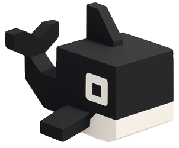

---
hide:
  - navigation
  - toc
---

|

# Open source AI on your HPC cluster

Launch models on campus GPUs and keep your data where it belongs.

[Learn more](about/index.md){ .md-button .md-button--primary }
[Get started](getting-started/installation.md){ .md-button }

