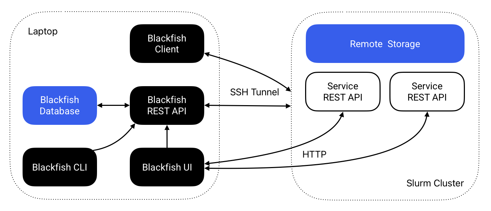

# Management Guide

This guide explains how to perform tasks to ensure that Blackfish has access to everything it needs in order to run services. If you are using Blackfish OnDemand, these steps have already been taken care of by your system admin.

If you are a system admin, or you do not have access to Blackfish OnDemand, these notes are for you.

## Architecture Overview

Blackfish consists of four components: a core REST API, a command-line interface (CLI), a browser-based user interface (UI), and a Python API. The core REST API performs all key service management operations while the Blackfish CLI and UI provide convenient methods for interacting with the Blackfish API. The Python API allows researchers to use Blackfish within Python scripts and pipelines.



**Figure 1** The Blackfish architecture for running remote services on a Slurm cluster.

The Blackfish REST API automates the process of hosting AI models as APIs. Users instruct the Blackfish API via the CLI or UI to deploy a model and the REST API creates a "service API" running that model. The researcher that starts a service "owns" that service and can secure it with an API key. Blackfish tracks service status and provides methods to stop and delete services when they are no longer needed.

In general, service APIs do not run on the same machine as the Blackfish application. Researchers can run the Blackfish API on their local laptop or on an HPC login node. When a researcher requests a model, they must specify a host for the service. The service API runs on the specified host and Blackfish ensures that it is able to communicate with the possibly remote service API. Typically, users will run services on high-performance GPUs available on an HPC cluster with a Slurm job scheduler.

!!! note

    Blackfish doesn't synchronize application data across machines. Services started from your laptop will not appear when running `blackfish ls` on the cluster, and vice versa.

### Application Data

Blackfish stores data in several different locations:

- Core application data is stored in `BLACKFISH_HOME_DIR` on the system where Blackfish is running (`~/.blackfish` by default). Core application data includes profile configuration, application logs, and database storage.
- Models and images are stored in the user-defined locations `home_dir` and `cache_dir`. These are profile-specific locations that need not reside on the machine where Blackfish is running. `home_dir` also stores job files created each time a service launches.

Let's consider what happens when a user launches a service from their laptop targeting a remote HPC cluster (Figure 1). The user will specify a profile that tells Blackfish the `host` and `user` of the targeted cluster. Blackfish uses this information to look for the required model and image files in both `home_dir` and `cache_dir`—also specified by the profile—on the cluster. If the required files exist, Blackfish creates a Slurm job script, stores it in `$BLACKFISH_HOME_DIR/jobs/$service_id`, and copies that job script to `$home_dir/jobs/$service_id` on the remote cluster. Finally, Blackfish remotely submits the Slurm job and stores its log files to `$home_dir/jobs/$service_id`.

## Images

Blackfish does **not** ship with the container images required to run services. These images should be downloaded before running services[^1]. The current required images are:

- Text generation: `vllm/vllm-openai:v0.10.2`
- Speech recognition: `princeton-ddss/speech-recognition-inference:0.1.2`

These images are expected to change over time, so be sure to check release notes for updates.

### Obtaining Images

Services deployed on HPC systems require Apptainer, which uses Single Image Format (SIF) images instead of Docker's OCI format. Docker images must be converted to SIF files before Blackfish can use them. For most images—including those hosted on the GitHub container registry—running `apptainer pull` will do this automatically. For example,

```shell
apptainer pull docker://ghcr.io/princeton-ddss/speech-recognition-inference:0.1.2
```

This command generates a file `speech-recognition-inference_0.1.2.sif` in the directory where it is run. Blackfish looks for images in the `cache_dir/images` directory specified by your profile. If you are an HPC admin setting up a shared environment, move images to the shared cache directory (e.g., `/shared/.blackfish/images`). If you are an individual user and your cache directory is read-only, ask your admin to add the required images or set your profile's `cache_dir` to a directory you can write to.

## Models

### Hugging Face Authentication

Some models on Hugging Face are "gated" and require authentication to download. You can create access tokens on the [Hugging Face security tokens](https://huggingface.co/docs/hub/en/security-tokens) page. Blackfish uses the [`huggingface_hub`](https://github.com/huggingface/huggingface_hub) library, which automatically detects authentication tokens from:

1. The `HF_TOKEN` environment variable
2. A token stored at `~/.cache/huggingface/token` (set via `huggingface-cli login`)

#### Setting a Token via Environment Variable

You can set the `HF_TOKEN` environment variable:

```shell
export HF_TOKEN=hf_xxxxxxxxxxxxxxxxxxxxxxxxxxxxx
```

Add this to your shell profile (`.bashrc`, `.zshrc`, etc.) for persistence.

#### Setting a Token via CLI

You can also use the Hugging Face CLI:

```shell
huggingface-cli login
```

This stores the token at `~/.cache/huggingface/token`.

### Automatic Downloads

You can download models with the `blackfish model add` command. Blackfish stores downloaded models in the `home_dir` of the specified profile by default. If you are downloading models to share with other users, add the `--use-cache` flag to save files to the `cache_dir` instead. Model download support is currently limited to Slurm profiles configured with `host=localhost` (e.g. Blackfish running on the cluster head node, such as within an Open OnDemand session). To download models for use on a remote Slurm cluster, you need to run Blackfish on the cluster itself.

### Manual Downloads

Internally, model downloads and management are performed by [`huggingface_hub`](https://github.com/huggingface/huggingface_hub). You can download models yourself using the same method:

```python
from huggingface_hub import snapshot_download
snapshot_download(repo_id="meta-llama/Meta-Llama-3-8B")
```

The `snapshot_download` method stores model files to `~/.cache/huggingface/hub/` by default. You should modify the directory by setting `HF_HOME` in the local environment or providing a `cache_dir` argument. Otherwise, after the model files are downloaded, they must be manually moved to your home or shared (cache) directory, e.g., `/shared/.blackfish/models`. For shared models, remember to set permissions on the model directory to `755` (recursively) to allow all users read and execute access.

!!! note

    In addition to downloading model files, the `blackfish model add` command extracts metadata from the model and adds it to an internal database of models available to the profile that was used to add the model. Manually added models will not show up when running `blackfish model ls` (because they are not added to this database), but Blackfish will still be able to discover and run these models.

## Batch Jobs

Blackfish delegates batch job execution to [TigerFlow](https://github.com/princeton-ddss/tigerflow), a companion project for running task-based pipelines on Slurm clusters. TigerFlow is installed automatically the first time you create a Slurm profile, so users typically don't need to manage it directly. If the install fails, users can re-run it via `blackfish profile repair`, and upgrade an existing install via `blackfish profile upgrade`.

## Resource Tiers

Resource tiers allow HPC administrators to define pre-configured resource bundles that users can select when launching services through the Blackfish UI. This simplifies the user experience by presenting meaningful options like "Small", "Medium", and "Large" instead of requiring users to manually specify GPU counts, memory, and CPU cores.

### Configuration File

Resource tiers are configured in a `resource_specs.yaml` file placed in the profile's `cache_dir`. For shared HPC environments, this is typically a shared directory like `/shared/.blackfish/resource_specs.yaml`.

If no configuration file exists, Blackfish uses sensible defaults with four tiers: CPU Only, Small (1 GPU), Medium (2 GPUs), and Large (4 GPUs).

### Schema

```yaml
time:
  default: 30
  max: 180

partitions:
  gpu:
    default: true
    tiers:
      - name: Small
        description: "Small models (up to 16GB)"
        max_model_size_gb: 16
        gpu_count: 1
        gpu_type: a100
        cpu_cores: 4
        memory_gb: 16
        slurm:
          constraint: "gpu80"

      - name: Medium
        description: "Medium models (up to 80GB)"
        max_model_size_gb: 80
        gpu_count: 2
        cpu_cores: 8
        memory_gb: 32

      - name: Large
        description: "Large models (80GB+)"
        max_model_size_gb: null
        gpu_count: 4
        cpu_cores: 16
        memory_gb: 64

  cpu:
    default: false
    tiers:
      - name: CPU Only
        description: "For testing or small models"
        max_model_size_gb: 2
        gpu_count: 0
        cpu_cores: 4
        memory_gb: 8

models:
  "meta-llama/Llama-2-70b-hf": "gpu.Large"
  "openai/whisper-large-v3": "gpu.Medium"
```

### Tier Fields

| Field | Type | Required | Description |
|-------|------|----------|-------------|
| `name` | string | Yes | Display name for the tier |
| `description` | string | Yes | User-facing description |
| `max_model_size_gb` | number/null | Yes | Maximum model size (null = no limit) |
| `gpu_count` | integer | Yes | Number of GPUs to request |
| `gpu_type` | string | No | GPU type label shown in the UI |
| `cpu_cores` | integer | Yes | Number of CPU cores |
| `memory_gb` | integer | Yes | Memory in GB |
| `slurm` | object | No | Additional Slurm flags |

### Slurm Configuration

The optional `slurm` section supports:

- `constraint`: Passed directly to Slurm's `--constraint` flag (e.g., `"gpu80"` for 80GB GPUs)
- `gres`: Custom gres specification (e.g., `"gpu:a100"`)

### Tier Selection

When a user launches a service, Blackfish automatically recommends a tier based on the model's size:

1. **Model override**: If the model appears in the `models` section, that tier is used
2. **Size matching**: Otherwise, the smallest tier whose `max_model_size_gb` exceeds the model size is selected
3. **Catch-all**: If no tier matches, the tier with `max_model_size_gb: null` is used

Users can override the automatic selection in the UI.

[^1]: If you only intend to run services on your laptop, Blackfish will attempt to download each image automatically the first time you run its corresponding service. In this case, expect the startup time for the first run of each service type to take much longer than subsequent runs.
